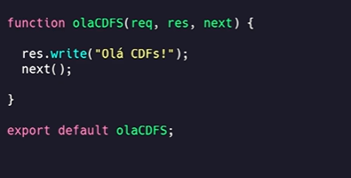

# Anotações de aprendizado

Anotações de conceitos e aprendizados desenvolvidos durante a criação prática do meu projeto atual.

## JWT

[Link do video](https://www.youtube.com/watch?v=Gyq-yeot8qM)

JWT (Json Web Token) faz parte do __JOSE (Json Object Signing and Encryption)__ assim como: 

- __JWS (Json Web Signature)__: assinatura do token
- __JWE (Json Web Encryption)__: criptografia para assinatura
- __JWK (Json Web Keys )__: chaves para assinatura
- __JWA (Json Web Algorithms)__: algoritmos de assinatura 
- __JWT (Json Web Token)__: Token em si

JWT é composto por 3 Claims, sendo a Header, Payload e Signature. Após isso é assinado pelo JWA, que serve para validar requisições entre endpoints e acessos.

- __Header__: qual tipo de algoritmo e token utilizado
- __Payload__: compoe as claims, podendo ser 3. as __Registred__, __Public__ e __Private__.
- __Signature__: Encode do header + encode do Payload, separado por .

## Middleware

[Link do vídeo](https://www.youtube.com/watch?v=HHd6F7rCzvY)

Middleware funciona como uma camada de software na arquitetura da aplicação que traduz a comunicação entre diferentes plataformas, protocolos e outros.

Ele permite o escalonamento do software justamente por permitir tradução entre plataformas, sistemas operacionais e outros.

Abaixo alguns exemplos de middleware

Exemplo prático de middleware:

req = requisição podendo acessar o lado do cliente
res = método response que permite enviar para o lado do cliente usando HTTP
next = função para continuar o próximop middleware

